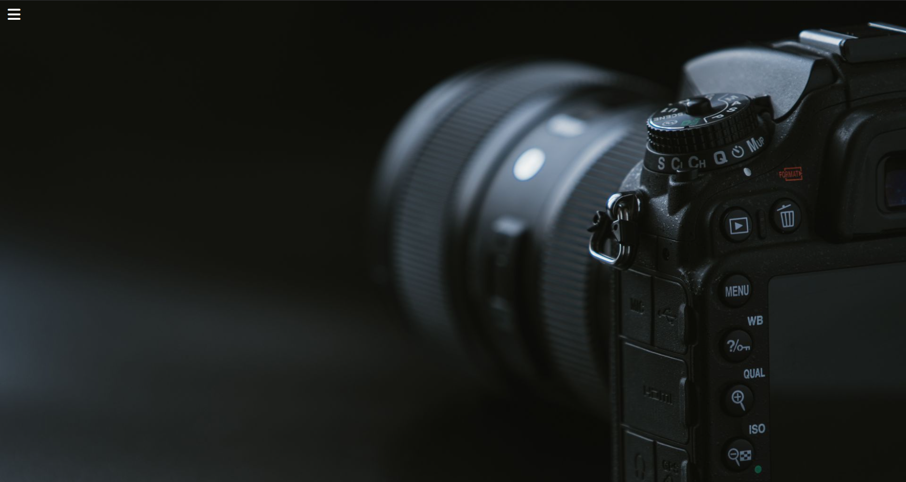
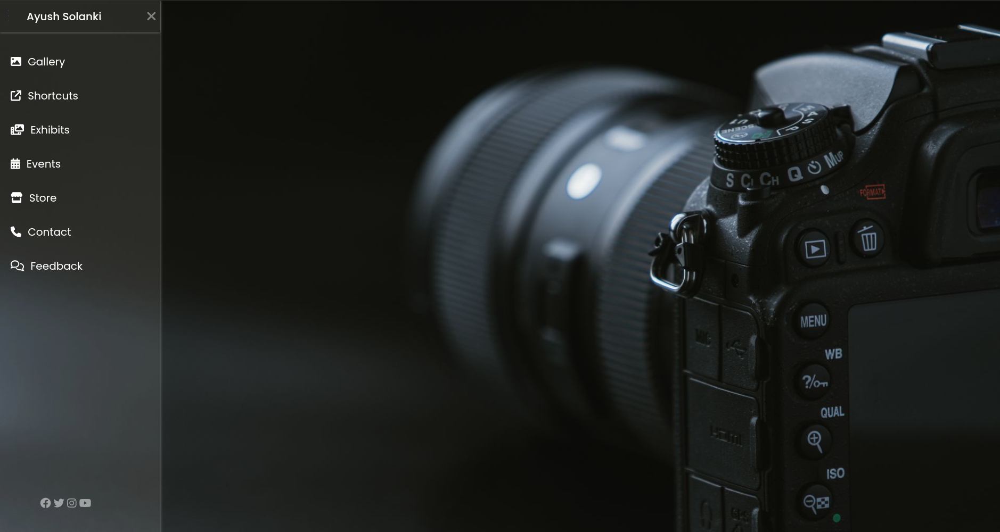

# Glassmorphism Sidebar Navigation

A modern **Glassmorphism Sidebar Navigation UI** built using **HTML5** and **CSS**. This project demonstrates a sliding sidebar with smooth CSS animations, a full-screen background image, hover effects, and a clean desktop-first user interface — all without using JavaScript.

---

## 📌 Project Overview

This project focuses on creating an elegant sidebar navigation menu using the **CSS Checkbox Hack**. The sidebar smoothly slides in and out while maintaining a modern glassmorphism-inspired appearance.

The primary objective of this project was to practice advanced CSS concepts such as positioning, transitions, hover effects, and layout design.

---

## ✨ Features

- Modern Glassmorphism UI
- CSS-only sliding sidebar (No JavaScript)
- Smooth open & close animations
- Full-screen background image
- Font Awesome icons
- Google Fonts (Poppins)
- Hover effects on menu items and icons
- Social media section
- Desktop-first layout

---

## 🛠️ Technologies Used

- HTML5
- CSS
- Font Awesome
- Google Fonts (Poppins)

---

## 📂 Project Structure

```
Glassmorphism-Sidebar-Navigation/
│
├── assets/
├── screenshots/
│   ├── desktop-1.png
│   └── desktop-2.png
│
├── project.html
├── project.css
└── README.md
```

---

## 📸 Screenshots

### Desktop View

| Sidebar Closed | Sidebar Open |
|----------------|--------------|
|  |  |

---

## 📚 Concepts Practiced

- CSS Positioning
- CSS Transitions
- Hover Effects
- CSS Checkbox Hack
- Glassmorphism Design
- Fixed Sidebar Layout
- Background Images
- Typography
- Font Awesome Integration
- Google Fonts

---

## 🚀 Future Improvements

- Make the layout fully responsive
- Improve mobile experience using media queries
- Add submenu support
- Add active navigation states
- Implement JavaScript interactions
- Add dark/light theme toggle
- Connect navigation links to actual pages

---

## 🎯 Learning Outcome

Through this project, I gained hands-on experience with:

- Building modern navigation layouts
- Creating CSS-only interactive components
- Working with transitions and animations
- Designing desktop-first user interfaces
- Organizing a project using reusable CSS classes

---

## 📄 License

This project was created for learning and educational purposes.