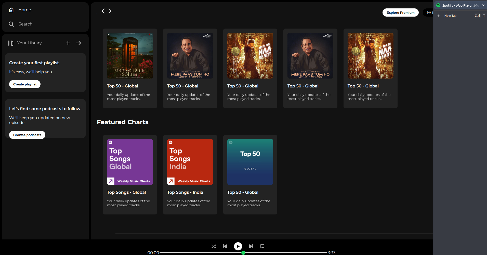
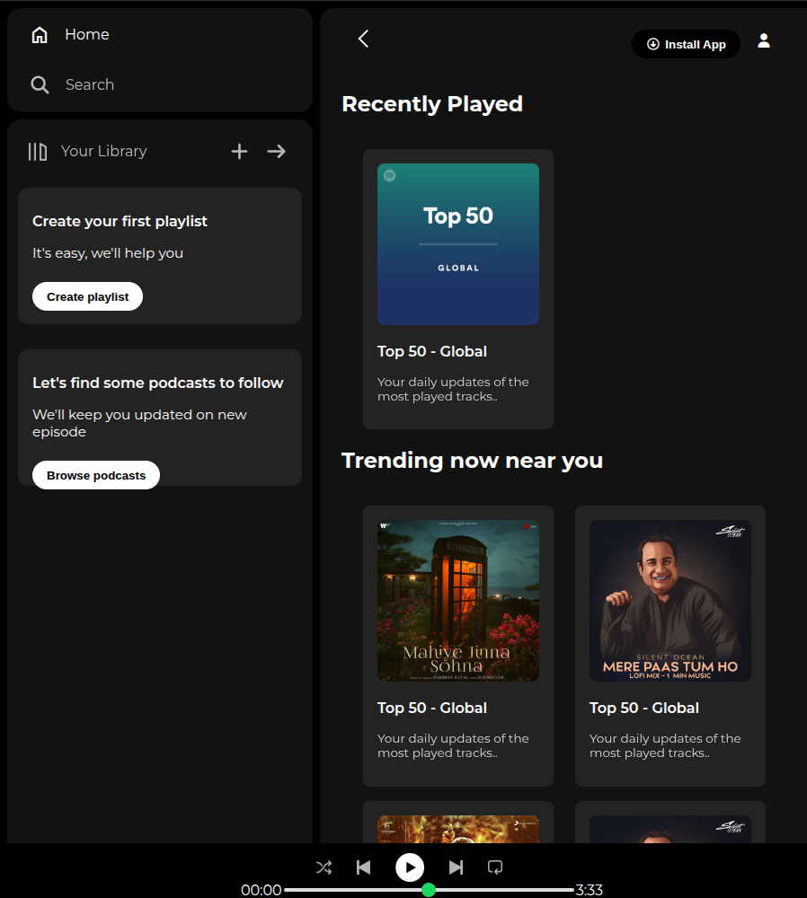
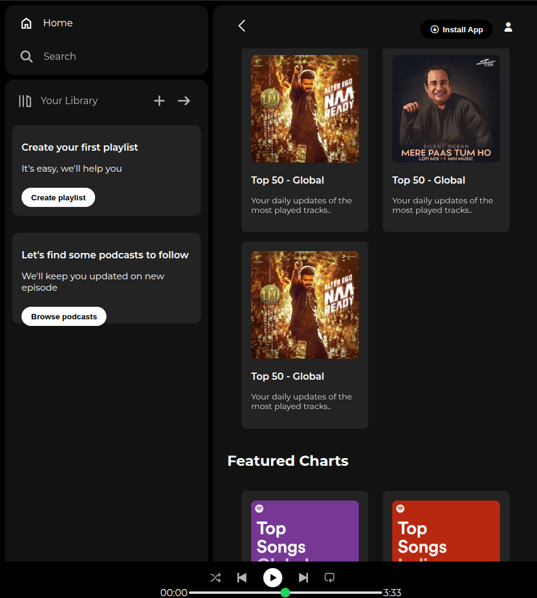

# 🎵 Spotify Web Player UI Clone

A responsive **Spotify Web Player UI Clone** built using **HTML5** and **CSS3**. This project replicates the layout and design of Spotify's web player to practice modern frontend development concepts such as Flexbox, responsive design, positioning, and custom UI components.

> **Note:** This is a frontend UI clone created for educational purposes only. It does not include music playback or backend functionality.

---

## 📸 Preview

### 🖥️ Desktop View

#### Homepage


#### Featured Content


---

### 📱 Responsive View

#### Homepage


#### Featured Content

---

## ✨ Features

- 🎧 Spotify-inspired user interface
- 📚 Sidebar navigation
- 📌 Sticky navigation bar
- 🎵 Recently Played, Trending & Featured sections
- 🎼 Music player UI
- 🎚️ Custom playback slider
- 📱 Responsive design
- 🎨 Modern dark theme
- ⭐ Hover effects and smooth interactions
- 🔤 Google Fonts integration
- 🎯 Font Awesome icons

---

## 🛠️ Built With

- HTML5
- CSS3
- Flexbox
- Media Queries
- Google Fonts (Montserrat)
- Font Awesome

---

## 📂 Project Structure

```
Spotify-UI-Clone/
│
├── assets/
├── screenshots/
├── index.html
├── style.css
└── README.md
```

---

## 📚 Concepts Practiced

- Semantic HTML
- CSS Flexbox
- Responsive Web Design
- Media Queries
- Sticky Navigation
- Fixed Footer
- CSS Positioning
- Custom Range Slider Styling
- Hover Effects
- Overflow Handling
- Typography
- Icon Libraries

---

## 🚀 Getting Started

Clone the repository

```bash
git clone <repository-url>
```

Navigate to the project folder

```bash
cd Spotify-UI-Clone
```

Open `index.html` in your preferred browser.

---

## 📌 Future Improvements

- Add JavaScript functionality
- Music playback controls
- Playlist interactions
- Search functionality
- Backend integration
- React implementation
- Spotify API integration
- Mobile-first improvements

---

## 🎯 Learning Outcome

This project helped me strengthen my understanding of:

- Responsive Layout Design
- Flexbox
- CSS Positioning
- Sticky & Fixed Elements
- Modern UI Design
- Clean HTML Structure
- CSS Organization
- Building real-world frontend layouts

---

## ⚠️ Disclaimer

This project is created solely for educational purposes to practice frontend web development. It is inspired by Spotify's web player and is **not affiliated with or endorsed by Spotify**.

---

## 👨‍💻 Author

**Ayush Solanki**

GitHub: **https://github.com/AyushSolanki22**

---

### ⭐ If you liked this project, consider giving the repository a star!