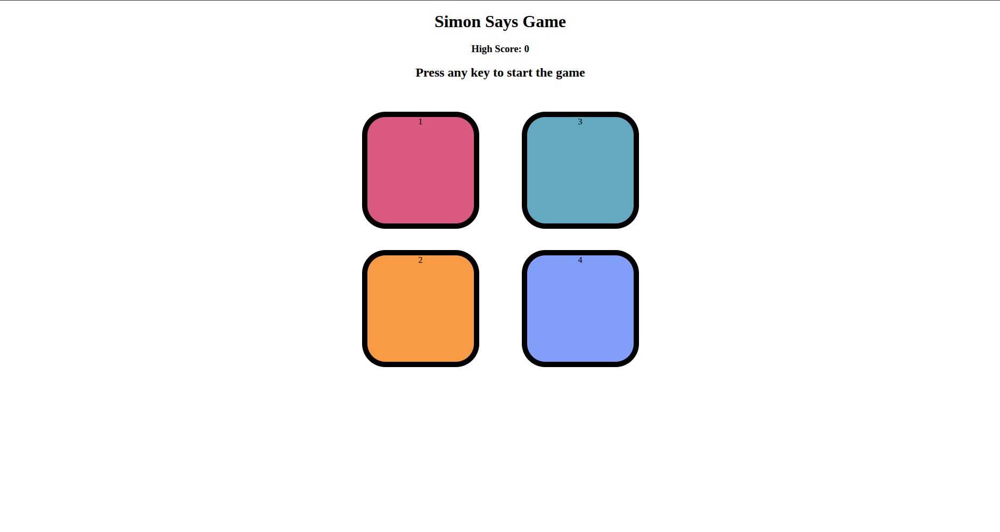
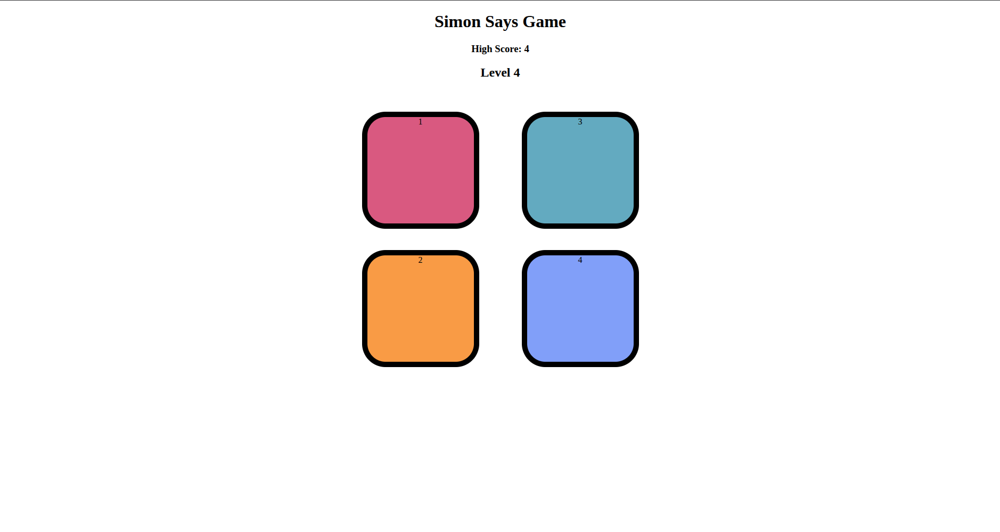
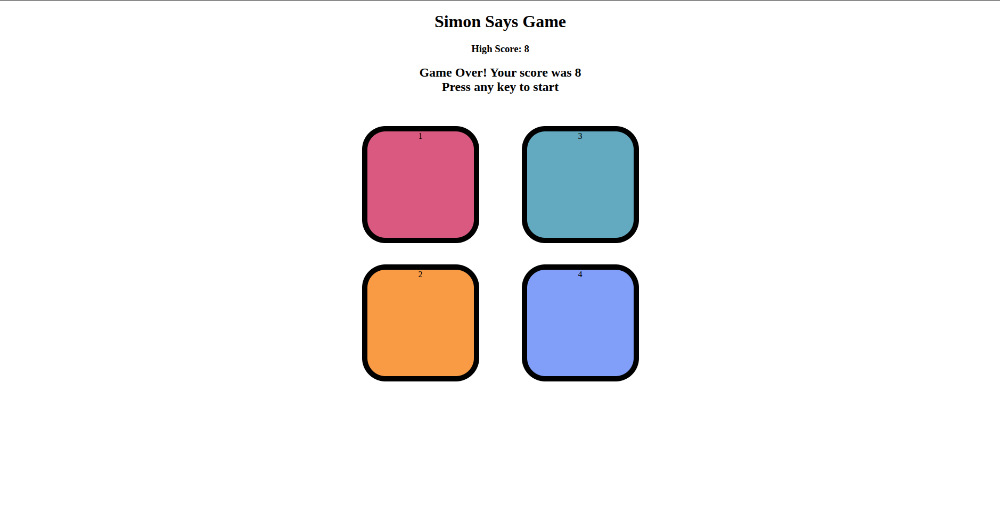

# Simon Says Game

A browser-based implementation of the classic **Simon Says** memory game built using **HTML**, **CSS**, and **JavaScript**. The game generates a sequence of colors that the player must memorize and repeat correctly. With each successful level, the sequence becomes longer, increasing the difficulty.

---

## 🌐 Live Demo

🔗 **Play the Game:** [Click Here](https://ayush-simon-says-game.netlify.app/)

---


## 📌 Project Overview

This project was built to strengthen my understanding of **JavaScript DOM manipulation**, **event handling**, **game logic**, and **state management** by recreating the classic Simon Says memory game.

The game keeps track of the player's current level and highest score achieved during the session.

---

## ✨ Features

- Interactive Simon Says gameplay
- Random color sequence generation
- Progressive difficulty (each level adds one new color)
- User input validation
- High score tracking (current session)
- Button flash animations
- Game over indication
- Restart game with any key press
- Simple and intuitive user interface

---

## 🛠️ Technologies Used

- HTML5
- CSS
- JavaScript (ES6)

---

## 📂 Project Structure

```
Simon-Says-Game/
│
├── screenshots/
│
├── index.html
├── style.css
├── app.js
└── README.md
```

---

## 📸 Screenshots

### Game Start



---

### Gameplay



---

### Game Over



---

## 📚 Concepts Practiced

- DOM Manipulation
- Event Listeners
- Arrays
- Functions
- Conditional Statements
- Loops
- Random Number Generation
- CSS Class Manipulation
- JavaScript Timers (`setTimeout`)
- Game State Management
- Dynamic UI Updates

---

## 🎮 How to Play

1. Press any key to start the game.
2. Watch the highlighted color carefully.
3. Repeat the sequence by clicking the colored buttons.
4. Every successful round adds one more color to the sequence.
5. Continue remembering the growing sequence.
6. The game ends when an incorrect button is pressed.
7. Press any key to restart.

---

## 🚀 Future Improvements

- Store high score using Local Storage
- Add sound effects
- Mobile touch support
- Responsive design
- Difficulty levels
- Start / Restart button
- Dark mode
- Game animations
- Leaderboard

---

## 🎯 Learning Outcome

Through this project, I gained practical experience with:

- Building an interactive browser game
- Managing application state
- Working with JavaScript arrays
- Handling keyboard and mouse events
- Updating the DOM dynamically
- Implementing game logic
- Using timers for animations

---

## 📄 License

This project was created for learning and educational purposes.
