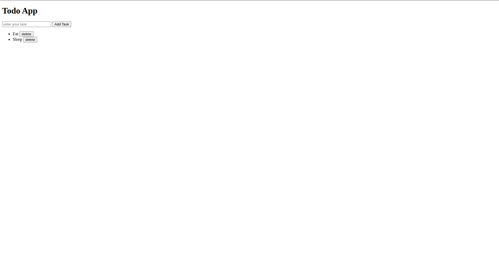

# JavaScript Todo App

A simple **Todo List** application built using **HTML**, **CSS**, and **JavaScript**. This project allows users to dynamically add and remove tasks while practicing core JavaScript concepts such as DOM manipulation, event handling, and event delegation.

---

## 📌 Project Overview

This project was developed to strengthen my understanding of JavaScript by building a dynamic Todo application that updates the webpage without requiring a page refresh.

The application demonstrates how JavaScript can be used to create, modify, and remove HTML elements dynamically.

---

## ✨ Features

- Add new tasks
- Delete existing tasks
- Dynamic task creation
- Event Delegation for delete functionality
- Automatic input clearing after adding a task
- Clean and beginner-friendly interface

---

## 🛠️ Technologies Used

- HTML5
- CSS
- JavaScript (ES6)

---

## 📂 Project Structure

```
javascript-todo-app/
│
├── screenshots/
│
├── index.html
├── style.css
├── app.js
└── README.md
```

---

## 📸 Screenshots

### Todo Application



---

## 📚 Concepts Practiced

- DOM Manipulation
- Event Handling
- Event Delegation
- Dynamic Element Creation
- Arrays & Variables
- Functions
- Input Handling
- CSS Class Manipulation
- Parent & Child Elements
- JavaScript Events

---

## 🎮 How It Works

1. Enter a task in the input field.
2. Click the **Add Task** button.
3. A new task is dynamically added to the list.
4. Click the **Delete** button beside any task to remove it.
5. The input field is automatically cleared after adding a task.

---

## 🚀 Future Improvements

- Prevent empty task submission
- Add Enter key support
- Edit existing tasks
- Mark tasks as completed
- Store tasks using Local Storage
- Responsive UI
- Task categories and filters
- Dark mode

---

## 🎯 Learning Outcome

Through this project, I gained practical experience with:

- Manipulating the DOM using JavaScript
- Handling user interactions
- Creating and removing HTML elements dynamically
- Implementing Event Delegation
- Building interactive web applications without frameworks

---

## 📄 License

This project was created for learning and educational purposes.