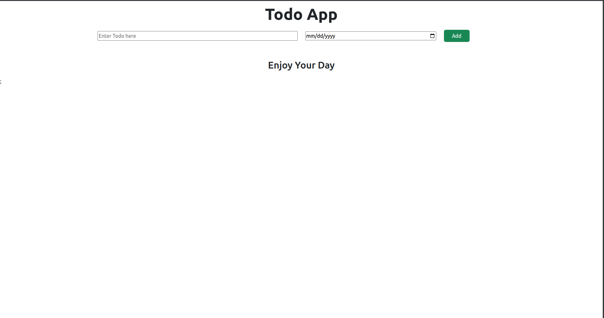
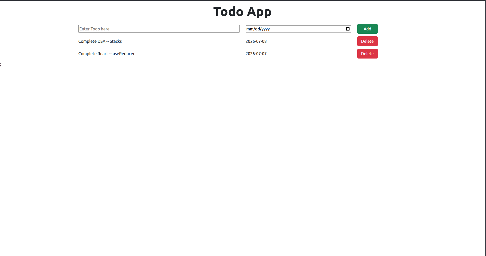

# React Todo App

A simple and interactive **Todo List Application** built using **React**. This project allows users to add and delete tasks while demonstrating fundamental React concepts such as **Components**, **Props**, **State Management**, and the **Context API**.

---

## 🌐 Live Demo

🔗 **Live Website:** *()*

---

## 📌 Project Overview

This project was built to strengthen my understanding of React by implementing a dynamic Todo application with reusable components and centralized state management using the **Context API**.

Users can:

- Add new tasks
- Assign due dates
- Delete existing tasks
- View a welcome message when no tasks are available

---

## ✨ Features

- Add new todo items
- Assign due dates to tasks
- Delete existing tasks
- Dynamic rendering using React
- Context API for state management
- Controlled form inputs
- Responsive layout using Bootstrap
- Welcome message for an empty todo list

---

## 🛠️ Technologies Used

- React
- JavaScript (ES6+)
- HTML5
- CSS Modules
- Bootstrap 5

---

## 📂 Project Structure

```
react-todo-app/
│
├── screenshots/
│
├── src/
│   ├── components/
│   ├── store/
│   ├── App.jsx
│   ├── main.jsx
│   └── index.css
│
├── public/
├── package.json
├── vite.config.js
└── README.md
```

---

## 📸 Screenshots

### Home Page



---

### Todo Added



---

## 📚 React Concepts Practiced

- Functional Components
- JSX
- useState Hook
- useContext Hook
- Context API
- Props
- Event Handling
- Controlled Components
- Conditional Rendering
- Dynamic Rendering using `.map()`
- State Updates
- Component Communication
- CSS Modules

---

## 🎮 How It Works

1. Enter a task name.
2. Select a due date.
3. Click **Add**.
4. The task is added to the list.
5. Click **Delete** to remove any task.
6. If there are no tasks, a welcome message is displayed.

---

## 🚀 Future Improvements

- Edit existing tasks
- Mark tasks as completed
- Store todos using Local Storage
- Task filtering (All / Active / Completed)
- Search functionality
- Drag and Drop support
- Dark Mode
- Due date validation

---

## 🎯 Learning Outcome

Through this project, I gained hands-on experience with:

- Building React applications using reusable components
- Managing application state with `useState`
- Sharing data using the Context API
- Passing data through props
- Handling user events
- Rendering lists dynamically
- Working with controlled form inputs
- Organizing React projects using components and folders

---

## ▶️ Getting Started

Clone the repository:

```bash
git clone <repository-url>
```

Navigate to the project directory:

```bash
cd react-todo-app
```

Install dependencies:

```bash
npm install
```

Start the development server:

```bash
npm run dev
```

---

## 📄 License

This project was created for learning and educational purposes.