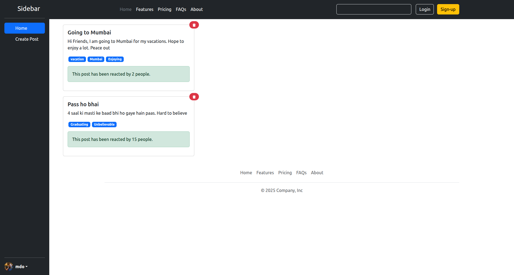
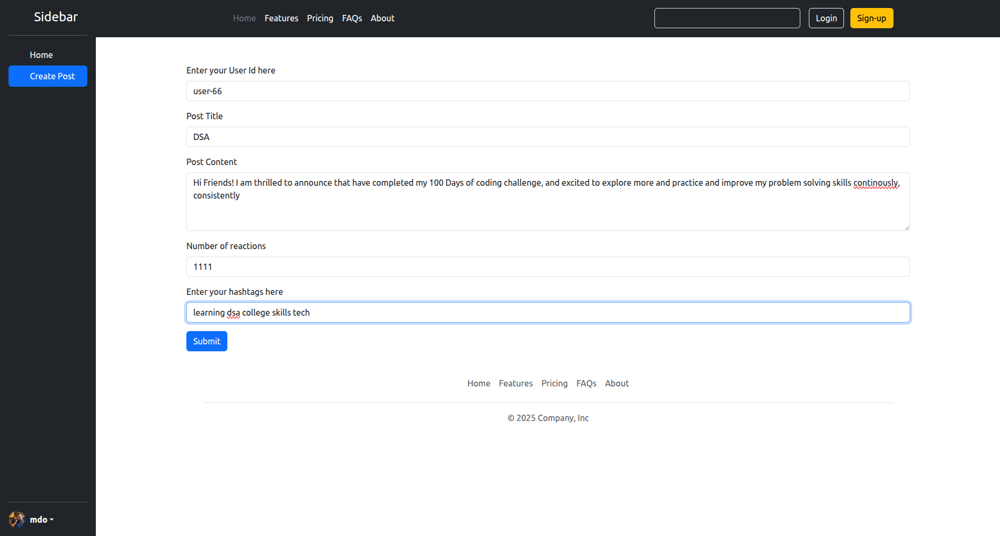
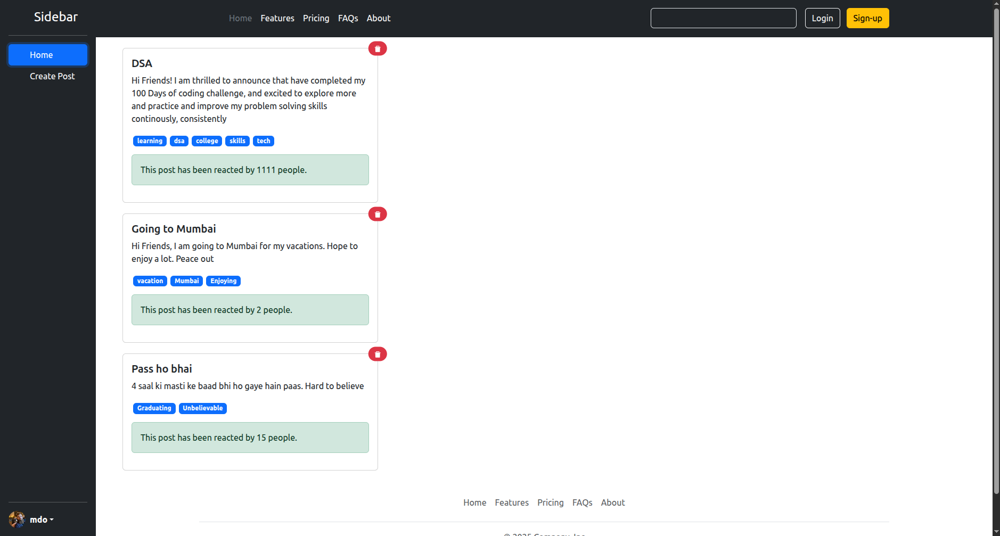

# 📱 React Social Media UI

A simple and interactive **Social Media Application** built using **React**. This project allows users to create and delete posts while demonstrating fundamental and intermediate React concepts such as **Components**, **Props**, **Context API**, **useReducer**, and **useRef**.

---

## 🌐 Live Demo

🔗 **Live Website:** *(https://react-social-media-ui.netlify.app/)*

---

## 📌 Project Overview

This project was built to strengthen my understanding of React by implementing a social media interface with reusable components and centralized state management using the **Context API** and **useReducer**.

Users can:

- Create new posts
- Delete existing posts
- View all posts dynamically
- Add hashtags to posts
- Display reaction counts

---

## ✨ Features

- Create new social media posts
- Delete existing posts
- Display posts dynamically
- Add hashtags to posts
- Display reaction count
- Context API for global state management
- useReducer for handling complex state updates
- Form handling using useRef
- Responsive UI using Bootstrap
- Component-based architecture

---

## 🛠️ Technologies Used

- React
- JavaScript (ES6+)
- HTML5
- CSS3
- Bootstrap 5
- React Context API
- React Icons
- Vite

---

## 📂 Project Structure

```
react-social-media-ui/
│
├── screenshots/
│
├── src/
│   ├── components/
│   │   ├── Header.jsx
│   │   ├── Footer.jsx
│   │   ├── Sidebar.jsx
│   │   ├── Post.jsx
│   │   ├── PostList.jsx
│   │   └── CreatePost.jsx
│   │
│   ├── store/
│   │   └── post-list-store.jsx
│   │
│   ├── App.jsx
│   ├── App.css
│   └── main.jsx
│
├── public/
├── package.json
├── vite.config.js
└── README.md
```

---

## 📸 Screenshots

### Home Page



---

### Create Post



---

### Post Added



---

## 📚 React Concepts Practiced

- Functional Components
- JSX
- Props
- useContext Hook
- useReducer Hook
- useRef Hook
- Context API
- Global State Management
- Event Handling
- Conditional Rendering
- Dynamic Rendering using `.map()`
- State Updates using Reducer
- Component Communication
- Bootstrap Integration

---

## 🎮 How It Works

1. Navigate to the **Create Post** section.
2. Enter the User ID.
3. Add a post title.
4. Write the post content.
5. Enter the reaction count.
6. Add hashtags separated by spaces.
7. Click **Submit** to publish the post.
8. Click the **Delete** icon to remove any post.

---

## 🚀 Future Improvements

- Edit existing posts
- Like and Comment functionality
- User Authentication
- Backend integration using Node.js & Express.js
- MongoDB database integration
- Fetch posts from REST APIs
- Image upload support
- Search and Filter posts
- Dark Mode
- Fully responsive mobile design

---

## 🎯 Learning Outcome

Through this project, I gained hands-on experience with:

- Building reusable React components
- Managing global state using the Context API
- Managing complex state using `useReducer`
- Handling forms using `useRef`
- Passing data through props
- Rendering dynamic lists
- Organizing React projects using components and folders
- Integrating Bootstrap with React
- Implementing CRUD-like operations on application state

---

## ▶️ Getting Started

Clone the repository:

```bash
git clone https://github.com/AyushSolanki22/react-social-media-ui.git
```

Navigate to the project directory:

```bash
cd react-social-media-ui
```

Install dependencies:

```bash
npm install
```

Start the development server:

```bash
npm run dev
```

---

## 📁 Repository

**GitHub Repository**

```
https://github.com/AyushSolanki22/react-social-media-ui.git
```

---

## 👨‍💻 Author

**Ayush Solanki**

- GitHub: https://github.com/AyushSolanki22

---

## 📄 License

This project was created for learning and educational purposes.